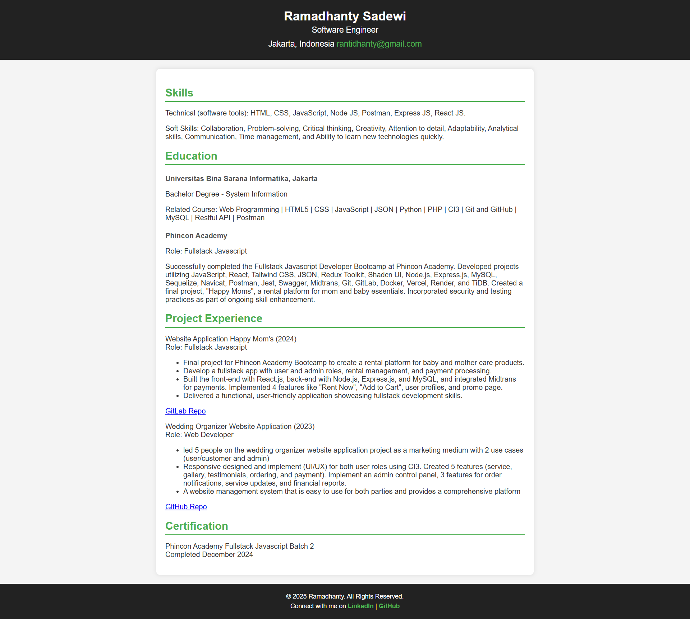

# Single Page CV - Roadmap.sh Project

Ini adalah solusi untuk proyek **Single Page CV** dari roadmap.sh.  
Proyek ini dibuat menggunakan **HTML & CSS** untuk latihan membangun halaman CV sederhana.

🔗 **Referensi Proyek:** [Single Page CV - Roadmap.sh](https://roadmap.sh/projects/single-page-cv)

## 🖼 Preview



## 🚀 Teknologi yang Digunakan

- HTML5
- CSS3

## 🛠 Cara Menjalankan

1. Clone repository ini:
   ```
   git clone https://github.com/rantidhanty/Roadmap.sh-Projects-Solutions.git
   ```
2. Buka `index.html` di browser.
